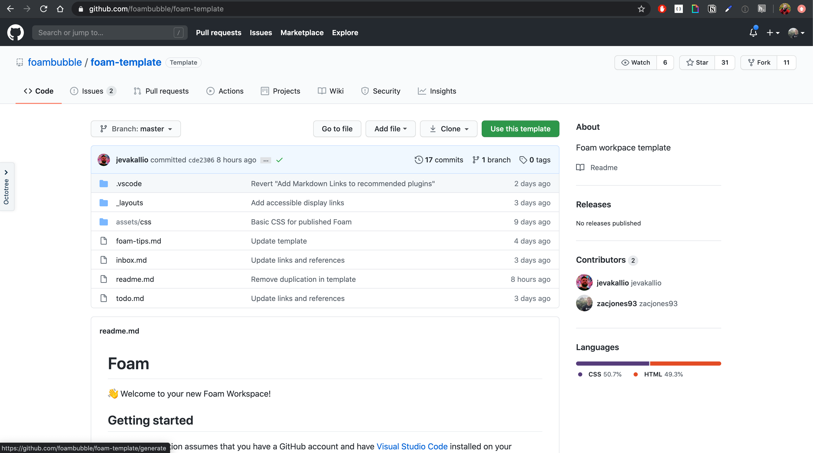
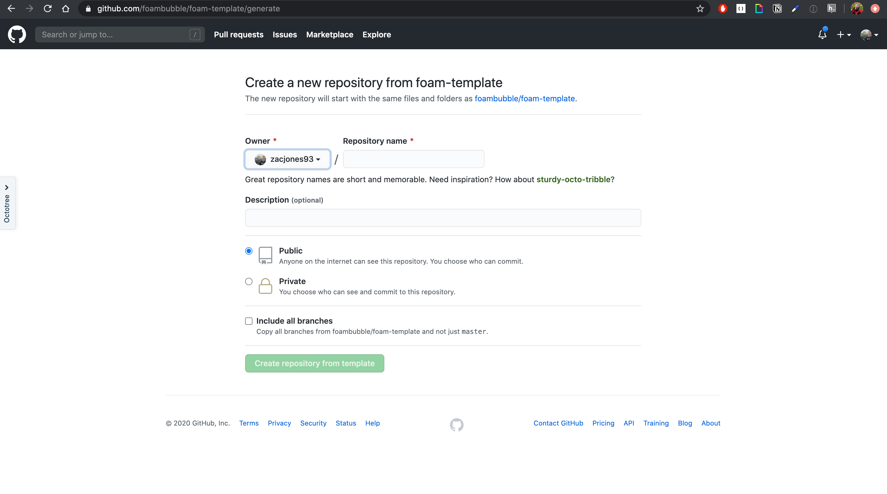
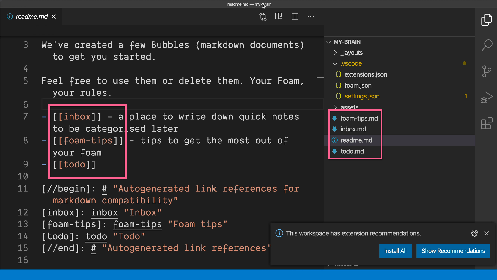
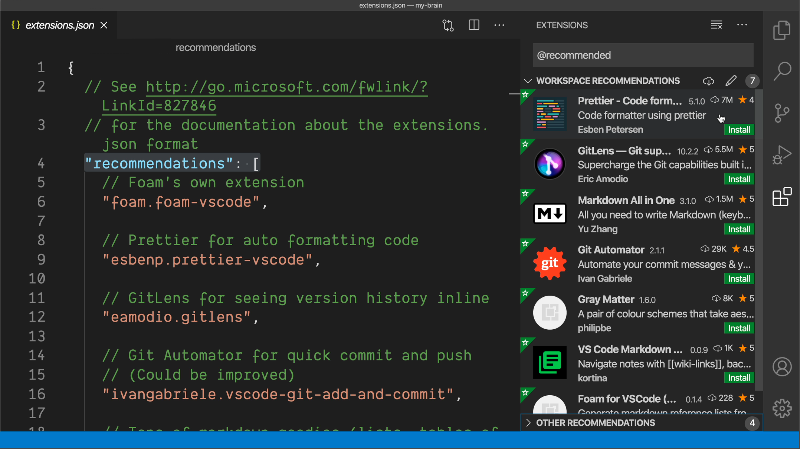
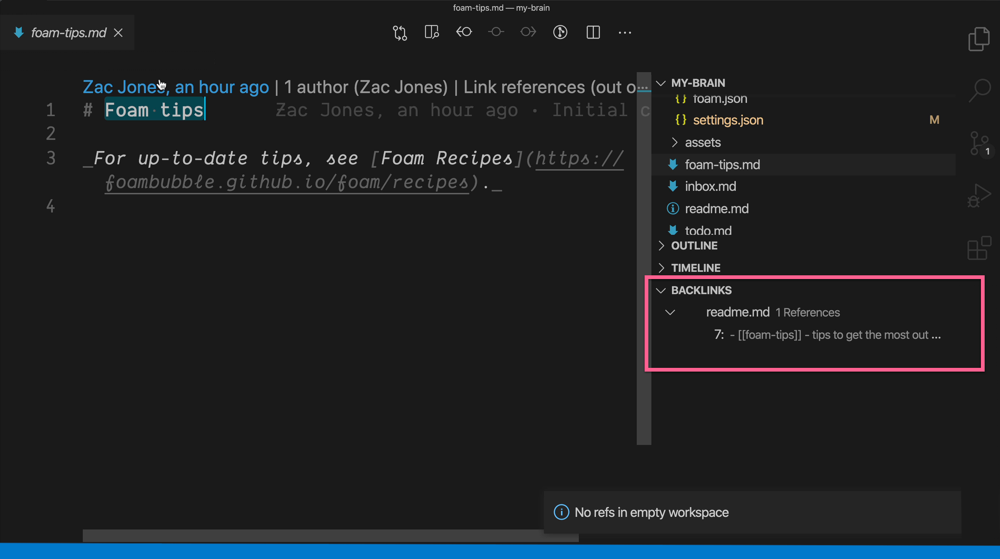
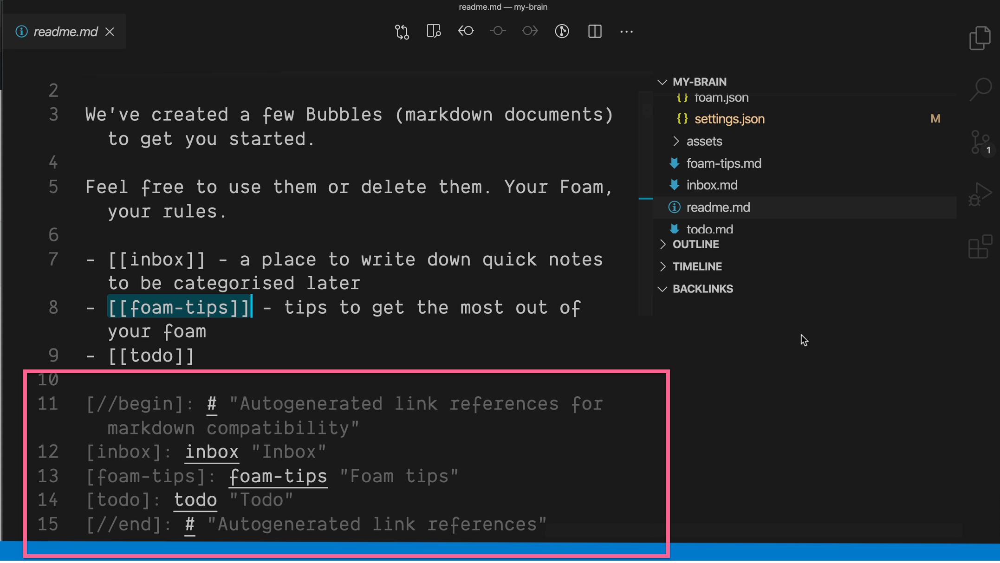
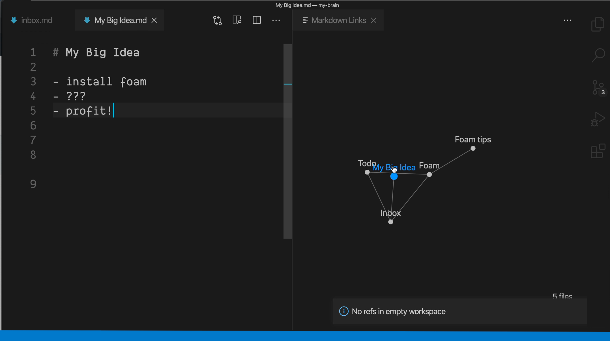

_Photo by [Paweł Czerwiński](https://unsplash.com/@pawel_czerwinski?utm_source=unsplash&amp;utm_medium=referral&amp;utm_content=creditCopyText) on [Unsplash](https://unsplash.com/s/photos/foam?utm_source=unsplash&utm_medium=referral&utm_content=creditCopyText)_

*Note:* This is a written adaptation of [Create a Second Brain in VSCode with Foam](https://egghead.io/lessons/vs-code-create-a-second-brain-in-vscode-with-foam?af=9r2pzd). If you prefer video, watch the lesson!

In the [foam-template GitHub repository](https://github.com/foambubble/foam-template) you'll notice that there's this `Use this template` button which you can click. 



It brings up an interface for you to create your own template based on that foam-template repository. 



I've already done so and cloned it locally in `my-brain` -- is what I call the project.

The first thing you'll notice is that there's already a `readme`, an `inbox`, a `todo`, and `foam-tips` markdown documents. 

You'll see that there's that double bracket syntax in the actual file.



0:41 You're supposed to be able to Command-click, but that doesn't work because you need to have the recommended extensions, which you can see because there are extensions recommended in this `.vscode` folder, this pop up shows, so I can hit Show Recommendations and the recommendations will show here.

1:10 I can click Install on all of them and navigate back to my readme. 



Here, it's still not working because we need to Command-Shift-P and reload the window. We can now Command-click and the linked reference will take me to the file that was linked.

1:32 Here in the BACKLINKS section, you can see that in `readme`, this `foam-tips` was linked too, and I can then navigate back to `readme` through the BACKLINKS menu over here. 



You'll notice that there is autogenerated links here that you won't want to edit yourself.



1:55 Here in my `inbox`, I have a big idea. I'm going to create `My Big Idea`.

### inbox.md
```
- some text in my inbox file

[[My Big Idea]]

[//begin]: # "Autogenerated link references for
```

Which will then, when I Command-click, generate a page that I can write My Big Idea down in. You'll notice that that backlink is now available.

### My Big Idea.md
```
# My Big Idea

- install foam
- ???
- profit!
```

2:19 Now that we've created My Big Idea, we'll want to see the graph for `My Big Idea`. To do so, hit `Command-Shift-P`. 

You'll notice the Show Graph command is up and the graph for our brain has been started with My Big Idea here and it being linked in our Inbox. We can now navigate through the graph in VS Code.

