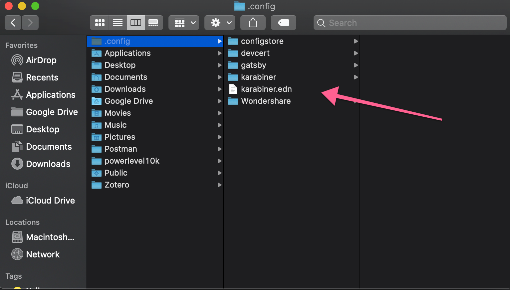
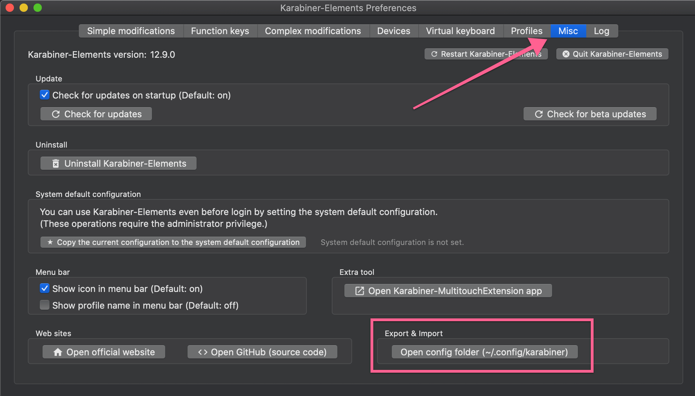

_Photo by [Clay Banks](https://unsplash.com/@claybanks?utm_source=unsplash&utm_medium=referral&utm_content=creditCopyText) on [Unsplash](https://unsplash.com/s/photos/uhk-keyboard?utm_source=unsplash&utm_medium=referral&utm_content=creditCopyText)_

[Karabiner-Elements](https://github.com/pqrs-org/Karabiner-Elements) is a utility for keyboard customizations. It allows you to map your keys to anything you want. This goes really deep in that you can have multiple layers as well as different &'modes' that your key bindings can live in.

[Follow the guide linked here to install Karabiner](https://karabiner-elements.pqrs.org/docs/getting-started/installation/) onto your system. You'll need to grant Karabiner a few permissions during this process

Karabiner uses JSON to configure the mappings that will be applied on your system. This gets verbose really quick due to the nature of JSON. To get around this and have a little better time configuring your key board, you can use a tool called [GokuRakuJoudo (Goku)](https://github.com/yqrashawn/GokuRakuJoudo) which allows you to build your bindings using an [edn format](https://github.com/edn-format/edn) which is much more concise.

The install is much easier:

    brew install yqrashawn/goku/goku

Now that you have it installed, it's time to create a file that goku will use to compile edn formatted commands to the JSON that karabiner expects.

Create a `karabiner.edn` in your `~/.config` folder. Mine looks like this:

An easy way to get to this folder in Finder is to click this button in the Karabiner UI:

Once you're done with this, you are ready to start customizing your keyboard!

I'm starting off small with re-mapping my shift keys to backspace and forward delete. More specifically, my left shift key is backspace and my right shift key is forward delete.

The other two mappings could also be useful with less hand movement for right command and left shift.

    {
    :main [{:des "taps"
            :rules [[:##left_shift :left_shift nil {:alone :delete_or_backspace}]
                    [:right_shift :right_shift nil {:alone :delete_forward}]
                    [:z :left_shift nil {:alone :z}]
                    [:caps_lock :left_control nil {:alone :delete_or_backspace}]
                    [:slash :right_command nil {:alone :slash}]]}
    ]}

I got this configuration from [John Lindquist](https://johnlindquist.com/customize-karabiner-with-goku), check his config out for more optimized keyboard goodness. Fair warning, he uses colemak so bindings might not make sense to qwerty users.

