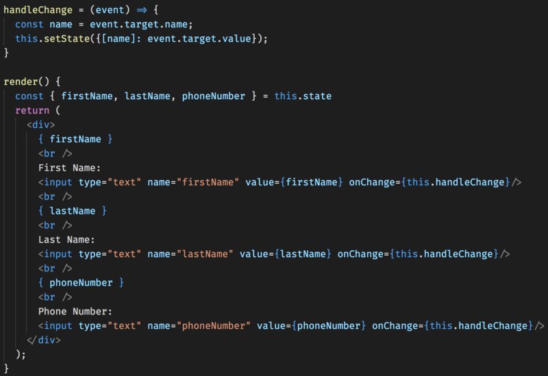
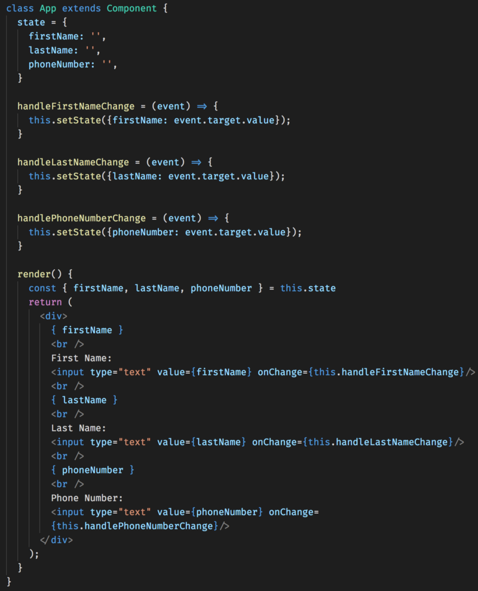
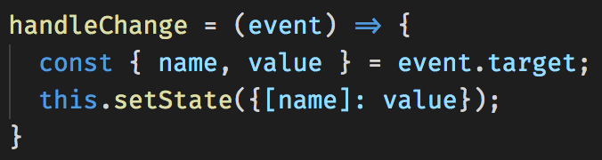

[create-react-app (CRA)](https://github.com/facebook/create-react-app) was used to generate the necessary boilerplate to start this React application. If you haven't used it before, you should! There is zero configuration and you won't need to touch Webpack or Babel. 😄

Here's a great tutorial on CRA if you haven't heard about it before: [Bootstrap a React Application through the CLI with Create React App](https://egghead.io/lessons/react-bootstrap-a-react-application-through-the-cli-with-create-react-app)

## Controlled Input

The standard way React handles user input is through Controlled Inputs. The React component that renders the form defines a function that determines what we do with user input in that form.

In the above example, `userInput` is being handled by the function `handleChange` which sets the components `state` variable, `userInput`, to the string typed by the user. `userInput` is then set as the value of the input.

The resulting output is rendered to the screen for feedback.

## The Problem of scaling Controlled Inputs

The problem that we run into is when we want to add more and more input fields into our Component is that it becomes needlessly verbose. The intuitive way to add more inputs is to just keep adding functions to handle the extra inputs.

Each input has it's own `handleChange` function which works but we broke one of the biggest rules in software development, DRY.

Don't Repeat Yourself! We just did that 2 times. 😳

Other than the state variables being updated, these functions are the same. There has to be a better way to do this.

## ES6 Computed Property Name

[ES6 Computed Property Name's](https://developer.mozilla.org/en-US/docs/Web/JavaScript/Reference/Operators/Object_initializer) solve this exact problem for us. We can set a name property on each input and access that property dynamically by using the bracket `[]` syntax of Computed Property Names.

We now have all our inputs handled by a single function that will take in the `name` of the input and update the corresponding state value.

We can even clean up our `handleChange` function by using a little more destructuring.

