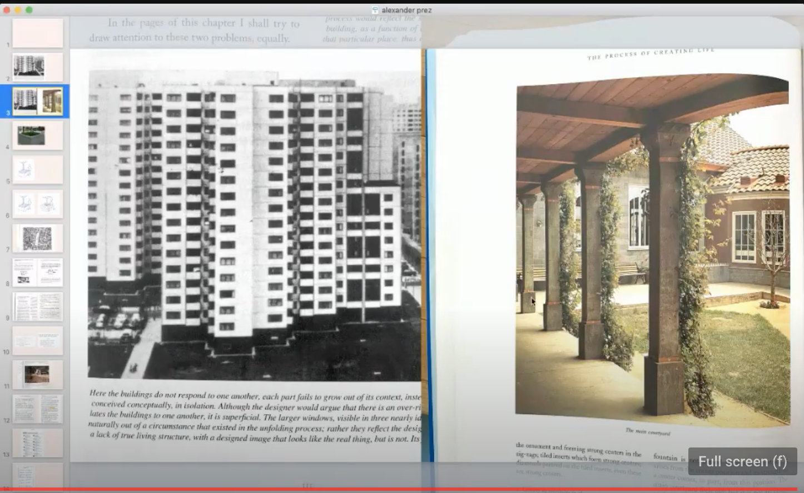
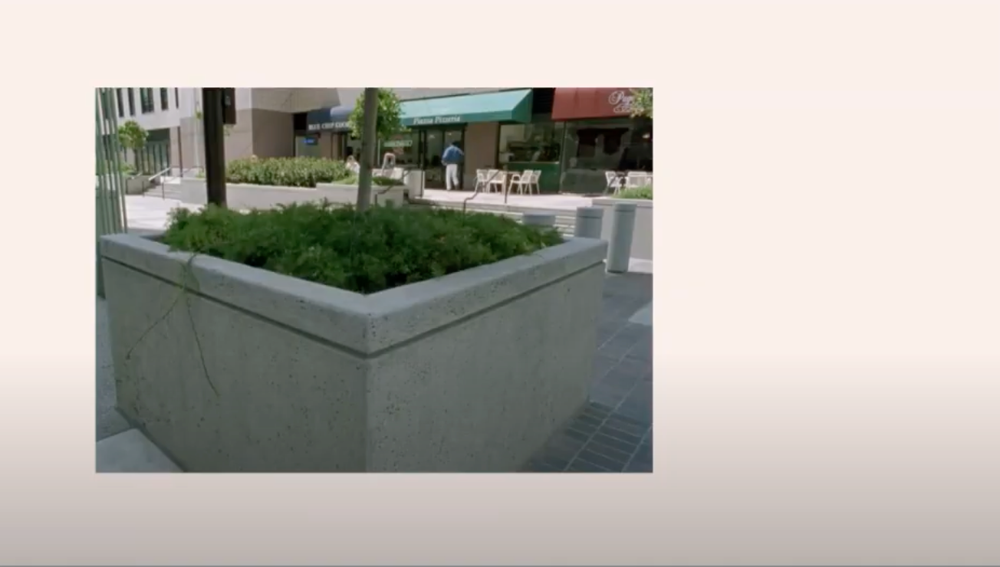
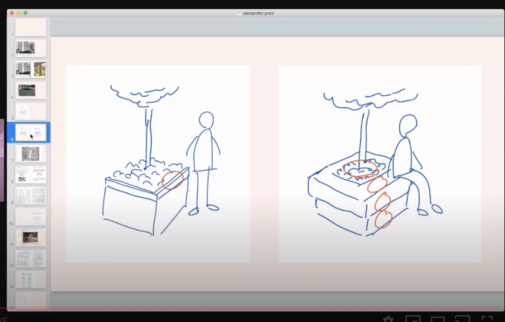
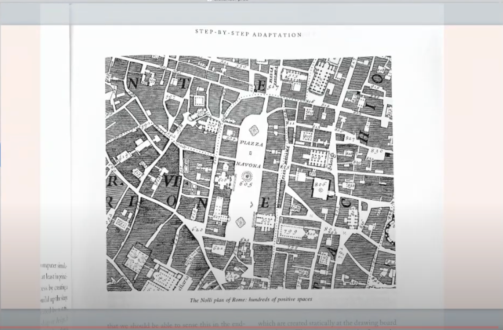
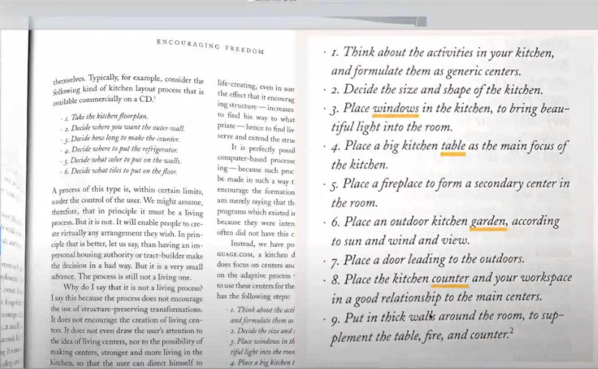
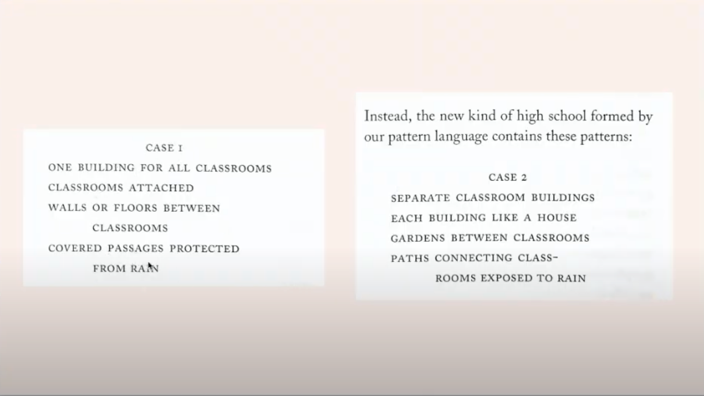
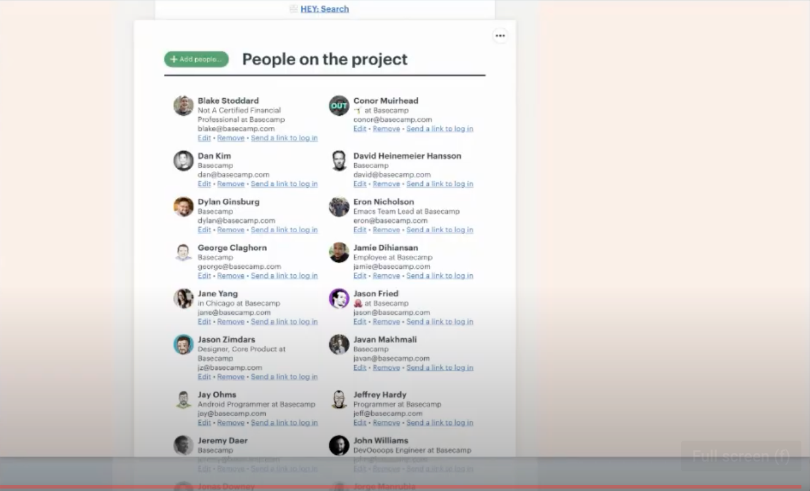
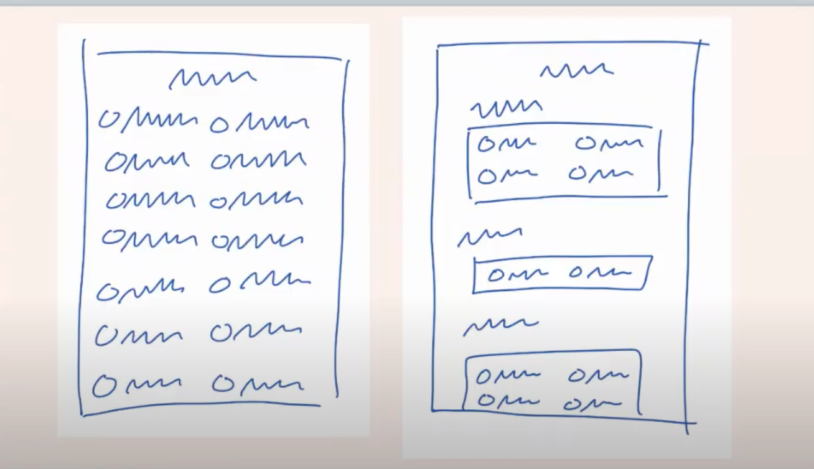
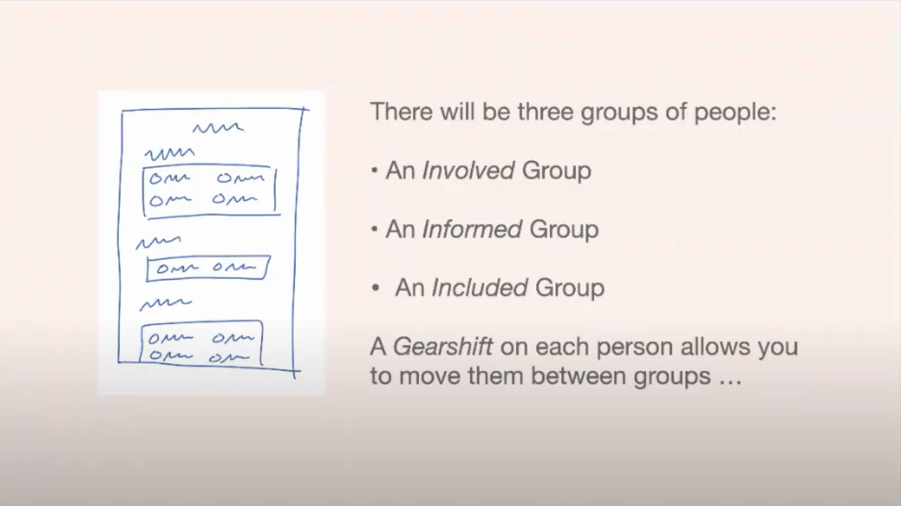

Photo by <a href="https://unsplash.com/@mzimasindzombane?utm_source=unsplash&amp;utm_medium=referral&amp;utm_content=creditCopyText">Mzimasi Ndzombane</a> on <a href="https://unsplash.com/s/photos/farm-house?utm_source=unsplash&amp;utm_medium=referral&amp;utm_content=creditCopyText">Unsplash</a>

# Table of Contents

- [Table of Contents](#table-of-contents)
- [Ryan Singer - Christopher Alexander: A Primer for System Designers](#ryan-singer---christopher-alexander-a-primer-for-system-designers)
  - [Basic arch](#basic-arch)
  - [Notes on the synthesis of form](#notes-on-the-synthesis-of-form)
  - [The Nature of Order](#the-nature-of-order)
    - [Example of soviet building vs Alexander designed building](#example-of-soviet-building-vs-alexander-designed-building)
    - [Modern planter in a plaza](#modern-planter-in-a-plaza)
    - [Tooling](#tooling)
  - [Battle - complete case study of the design of the school](#battle---complete-case-study-of-the-design-of-the-school)
  - [Software case-study](#software-case-study)
  - [Final thoughts](#final-thoughts)

These are notes on Ryan Singer's introduction to Systems Design and reflections on Christopher Alexander's thoughts.

Highly recommend you [watch the youtube video](https://www.youtube.com/watch?v=XLsTZXT0FlM).

# Ryan Singer - Christopher Alexander: A Primer for System Designers

-   Christopher Alexander

## Basic arch

-   how do we frame a design problem so that we make things better out of it?
-   What is the actual outcome we are trying to reach by solving the design problem?
-   What are the actual process that we use to get the design that we want?

## Notes on the synthesis of form

-   Alexanders system is very recursive
    -   find an area - differentiate it,

The important thing is the first two chapters. You get three concepts:

-   **<a id="org64e1a5f">Form</a>:** There's some part of the whole world that we are going to create and change
    
    If you only talk about the Form, you won't have meaningful success

-   **<a id="org75c72ac">Context</a>:** The activities that people are trying to do
    There's typically a 'right way' to do things.. we'll make software and buildings that follow a format without understanding why.
    
    Constraints on the dynamics of the situation
    
    There isn't one way to design anything.
-   **<a id="orgdb3f1aa">Fit</a>:** the judgement of success is between how Context and Form fit together by describing the behavior and intentions of people
    
    need to understand the behavior of people in the context they are in to determine the fit of a solution

How do you describe the context in a Form agnostic way?

## The Nature of Order

Alexander wants to create a better world.

-   **<a id="org2794ac3">Life</a>:** the degree to which a certain Form enables different type of activity

### Example of soviet building vs Alexander designed building

There's no structure with the soviet building. It's designed for a narrow set of actions. You can enter the building and go to your room

Theres a lighting up of the brain with Alexanders structure. Your eyes move along the structure.
You can go for a stroll. Sit and read. Children can play in the middle. Sit in the shade or in the courtyard. You can have gatherings, socialize, eat. Meet with a friend and have a conversation.

Those activities won't happen with the soviet building

### Modern planter in a plaza

Not very alive. Not much Form and not much action here.
Not much in activities that could take place at this plaza

very narrow edging. you could maybe set your coffee there.

To make it more alive - you change the Form and widen the amount of activities that can happen around it.

The sitting isn't the important thing. The different occasions in which they would sit is.. Could wait for someone, or sit and chat with a friend, could take a phone call there to escape the office, enjoy the fresh air, take a break and have a coffee.. a flourishing possibilities

Form can be modified to fit within the Context of someone wanting to sit -> a lot of actions can come out of it by adjusting the Form to allow sitting which increases it's Life.

### Tooling

We need a way to get from a first order view to a higher order view to actually use these concepts

-   **<a id="org9101fac">Centers</a>:** Static aspect - how do we take a snapshot of what exists of spacial structure and how do we describe the characteristics and arrangement of things to bring more Life to the place
    
    Book 1 of Nature of Order
    
    Any structure that we point to is some elements in a relationship. There's structure of atoms, pixels, sound waves that exist in a relationship to each other.
    
    They have a coherence or lack of coherence to each other.
    
    A Center is more coherent, salient, and related to each other
    
    This gives us a way to talk about and refer to a unit of change.
    
    You have a world of form and you can draw a dotted line around one part. a Center.
    
    A human face. A system of very well connected forms. There is still some points that are more salient and coherent than others. The cheek cone is a center. it connects the eye to the ear though it's function is secondary.
    
    A great entry way is another Center. There are salient elements that are knit together. stairs and windows and the plants surrounding it.
    
    Strong Centers and Weak Centers
    
    There are 15 properties - different relationships to other Centers.
    
    Boundaries are one of the properties. (thicken the boundary of the planter example - gives us a better Form)

-   **<a id="org868611e">Generative Process</a>:** Dynamic Aspect - by what process do we improve this Form.

Book 2 of Nature of Order

Patterns and pattern languages.

Software has used it but to a small extent.

Shows an amazing network of Centers. It's aesthetically pleasing and theres many functions that happen here. So much Life.

How do you get here?

Theres too much Fit -ness of parts to just think this up.

Multiplicity of well adapted parts

Doing one thing at a time with careful attention of what's already there.

-   Step by step adaptation
-   **<a id="org1dd2840">Sequence</a>:** the order of problem solving
    theres path dependence here

How can we use a pattern language to unfold something?

-   **<a id="orgbc0935a">Pattern</a>:** generic relationship of Centers

Centers -> Structure -> Form
Pattern is a bundle of Form and Context
A generic handful of Centers have been defined. Every time a Context happens, we can solve it with a handful of Centers.

When we run into a problem, we can pull out this Pattern and produce more Life out of it.

Pattern - 6 foot balcony
if you build a balcony that's less than 6 feet deep, people won't use it.
People like to sit around each other - you need depth in the balcony.
People like to spread out - the activity needs space.

Generic definition of a Center. but it gives you an essential aspect of the relationship of the Forms in that Context. This Pattern enables a Form to have a lot of Life.

-   Farm house kitchen example

Window - in a way a pattern
Garden - also a pattern

We're weaving these into a language and getting into Sequence

Look at the sequence between the two examples.
We prioritize different aspects of the Form.

We place the windows so that we can place the table so that we can have good light at the table.

Then place the doorway to the garden because that's more important than the counters

the counters can now fill in the rest of the space.

Which do you place first- the house or the garden?

The garden has few configurations to Fit in a way that creates Life.

The garden, because it's an outdoor space can relate the house to other spaces in the Context. The house can be configured successfully anywhere the garden is placed.

Pattern languages may be useful in terms of helping us communicate solved problems in a way that is more or less modular.

NOT the deeper meaning of patterns.. this is an efficiency gain.

A Pattern Language is a way to specify one unique product.

This is a longitudinal view - how to step by step solve the problem in which order to make the one thing right.

Making one product that brings Life is hard.

A Pattern Language is what we create to specify abstraction for one project.

So we can step by step navigate the Centers of the project and weave them together.
It allows us to talk about the design at a level of abstraction without over specifying.

The field of relationships in a project is too complex. We need a high-level way to navigate those fields. You can talk at the high level and the people that are going to do the work can dig deep into how it should get done (Shape up!!)

-   Pattern Language for building a university

This language in each case generates different designs. There are whole classes of designs that are created by each class

Well get a different Form Context Fit depending on the language we choose.

-   another case study
    
    
    What are the patterns that we need to pull in to solve this?

## Battle - complete case study of the design of the school

## Software case-study

Basecamp people of the project

may strike us as the soviet style building. uniformity of scale. not much interesting structure going on.

We might have a sense of glazing over with all the names here.

There are activities here that would like to be achieved.

Who just has access vs who is really involved here?

Potential for better structure

levels of repetition (one property to a Center)

just because you're grouping people.. doesn't mean it will be better.

If you have something from the Context that you can use, it can be better (the answer of the question above)

Who's actively involved
Who's informed
Who's included

You created stronger Centers. You know who to ask a question to.

The structure is stronger in terms of Form.

More hierarchy, more meaningful.

Enter Shape Up 😄

This level of abstraction gives developers the freedom to solve the problem given the facts on the ground while directing them at a high level.

## Final thoughts

Frame the Problem in terms of Form and Context

Not just about Fit but Fit between Form and Context that increase Life in a way that we want. Make a whole structure that makes meaningful things happen based on that structure.

We have the right abstraction to talk about the Centers in the structure and the Patterns that we find.

Then we can properly Sequence the project through a Pattern Language that fits the problem.

This allows the actual implementation to have freedom.

The output of the shaping process is a pattern language. You hand that to devs who will implement that pattern language

If there's any area that someone is struggling that we can respond to the struggles with a better adapted design will produce some healing.

How do you know when you're on the right path but not just trial and error? (Sequence)
Which things are most important. Which things have the fewest degrees of freedom in which they work.
You have an asymmetry and dependence of Centers. What are the dependencies between elements. How constrained is the solutions space for pieces of those.

Composed method - small talk pattern.

TODO: read first two chapters of notes of synthesis
Read Battle to see where Pattern Language is involved
Go deep: Nature of Order