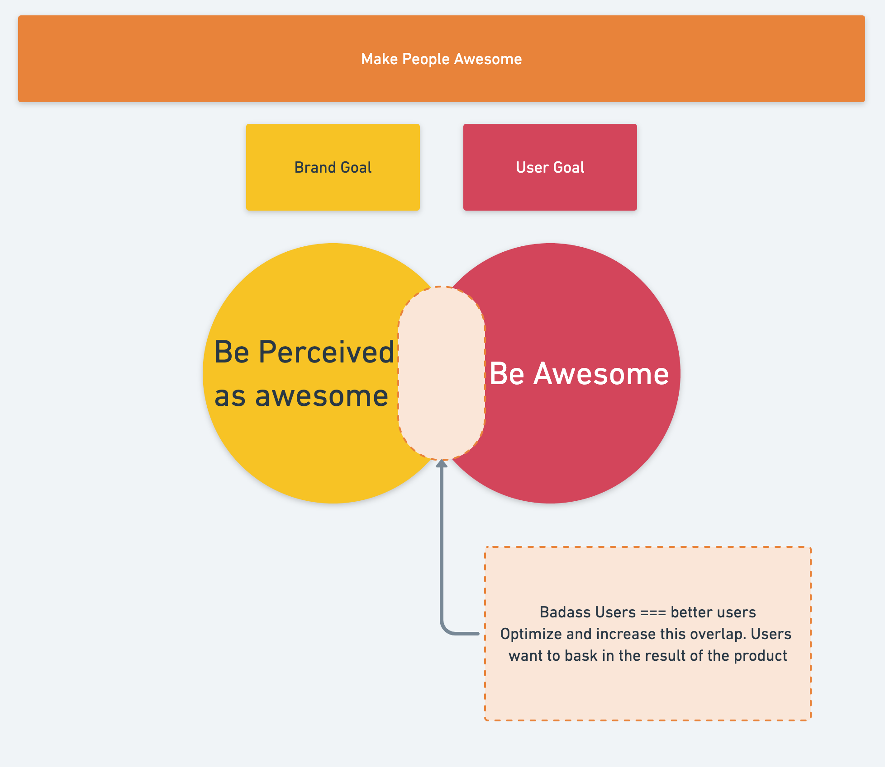
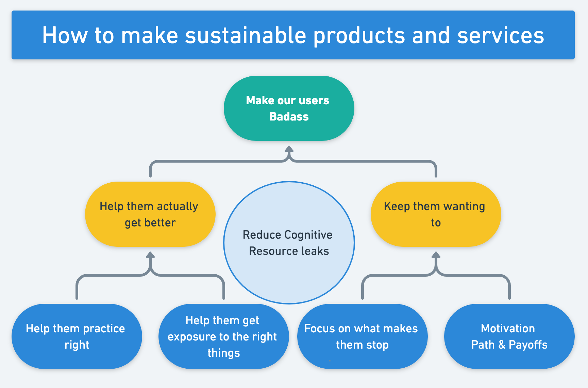
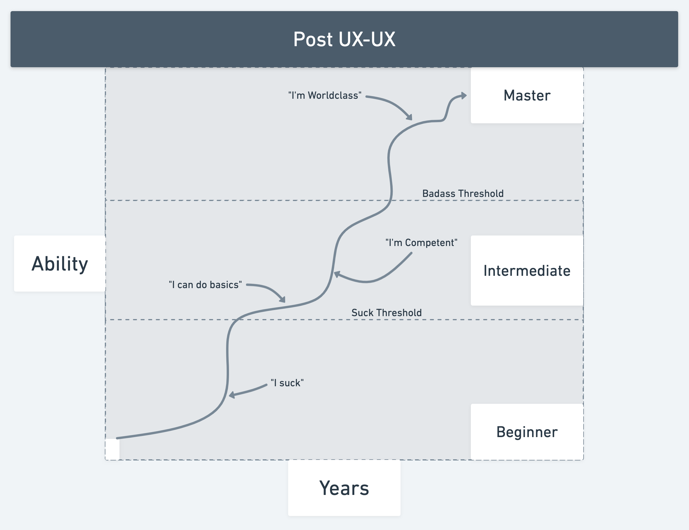
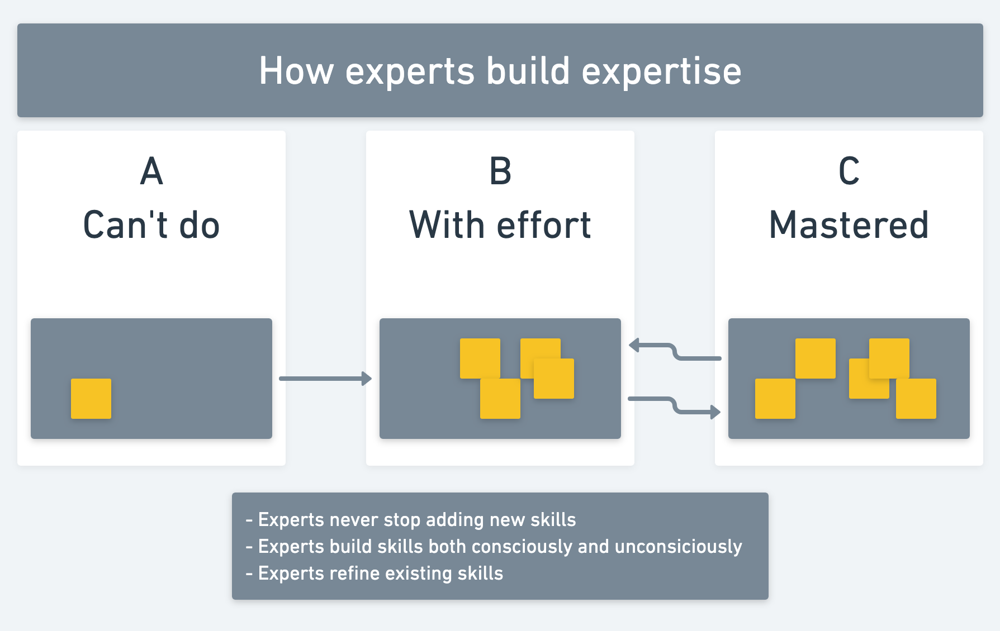

At the beginning of Badass, Kathy poses a question to us:

What makes a best selling product... best selling?

There are quite a few factors that go into making a product or service amazing but can we pin point exactly what makes a product _the best_. 

Is it:
- product quality?
- lowest price?
- aesthetic? 
- best marketing campaign? 

...luck?

All of these factors (and many more, of course) play into what creates a sustained best seller but the common thread amongst these products is that they are **recommended**.

And when Kathy says recommended, she literally means a word-of-mouth, non-incentivized recommendation from one person (likely friends) to the next. 

As simple as that.

This begs the question, what incentivizes users towards recommendation?

## Product Awesomeness vs. User Awesomeness

Early in the book, Kathy introduces us to the ideas of `Product` and `User` awesomeness.

Generally speaking, the temptation for companies is to be product focused and want you to see how awesome the product is.

This might make sense initially, you're building the product right? You know how awesome what you're building is and people should know.

But what do you do about marketing?

Before the purchase, marketing is **all about the user**. Companies show the user how they can be awesome with their product and the things they could accomplish. 

However, after the purchase, the narrative switches. No one cares about you anymore, it's all about the tool, product, or service bought. 'User' (-> Product) manuals and documentation give dry descriptions of what the tool can do with little regard for where you are at using the tool or what you could possibly.

This type of behavior shows [KEEP WRITING HERE]

It's all about making people sucessful, users _want_ to bask in the glow of the result of the product you provide.

> Users don't evangalize to their friends because they like the product, they evangelize to their friends because they like their friends.

> Mike Arauz

High Resolution means you percieve more about a skill or field.

Gamification - rewards behavior the company wants, not the user. 
Don't make them feel badass, help them BE it

Hi-Res in the bigger context? -> more skilled at a bigger context?

Design for the post ux-ux -> What have you given her to show at a dinner party

"Our users are better than this than their users"

## Perceptual exposure
Expert - Given a representative task in a domain, a badass performs in a puerior way, more reliably.

Perceptual exposure - surround yourself with experts, use a high quantity of high quality examples that seem different on the surface, but actually aren'task

Perceptual exposure exercises don't explain. They create a context that lests the learners brain 'discover' the pattern.

Being taught is not as powerful as discovery

-> Experts practice better
-> Experts develop deep perceptual knowledge and skills through high-quality, high-quantity exposure with feedback

## Remove Blocks

Acknowledge the suck - some things are just hard, you don't need to hide that.

Users need to know exactly where they should be - if something is hard, it might not seem like enough progress is being made

In a similar vein, if something is bad about your product, tell them. Let them know it's not them. This will free up cognitive resources
